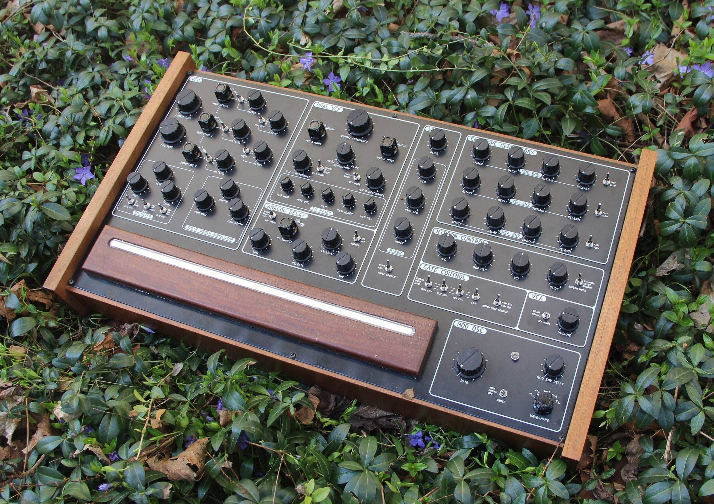

# josh_Ox_ribbon_synth
Ribbon synth for [Josh Oxford](https://www.joshoxford.com/) featuring a single VCO with two sub-oscillators, two state-variable filters, ring-modulator, VCA, three ADSR's, and a versatile modulation oscillator.

