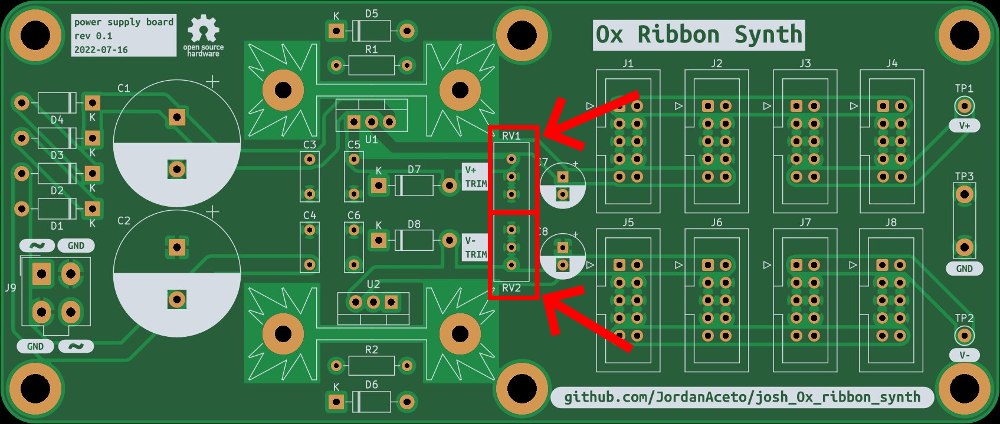
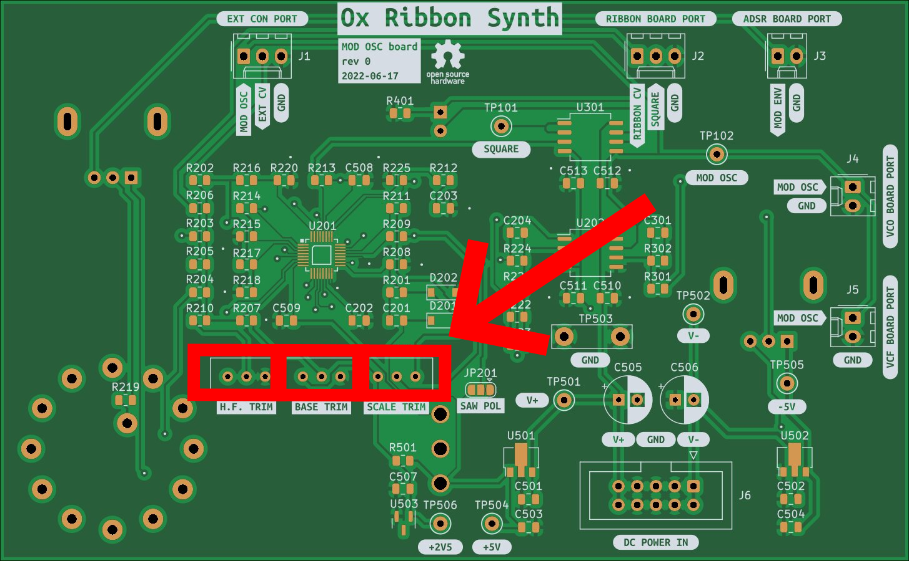
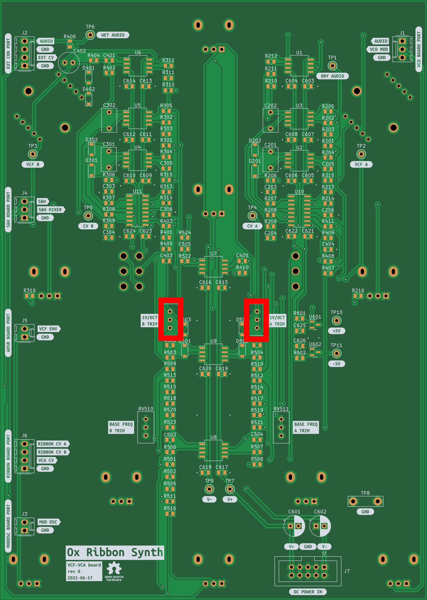
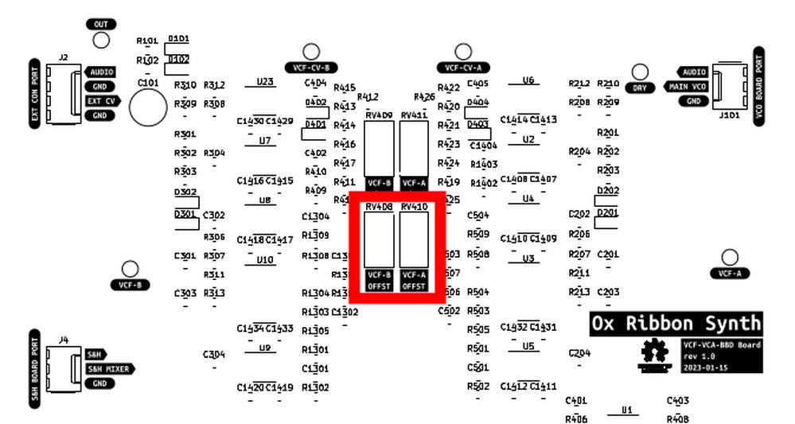
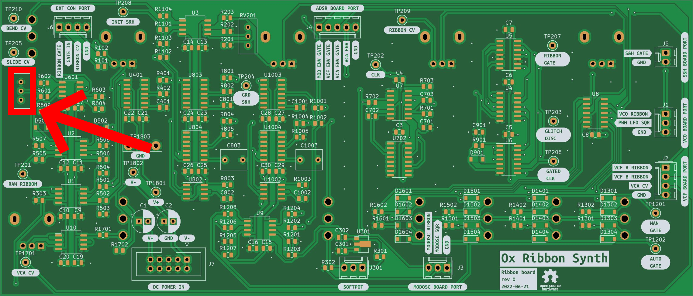
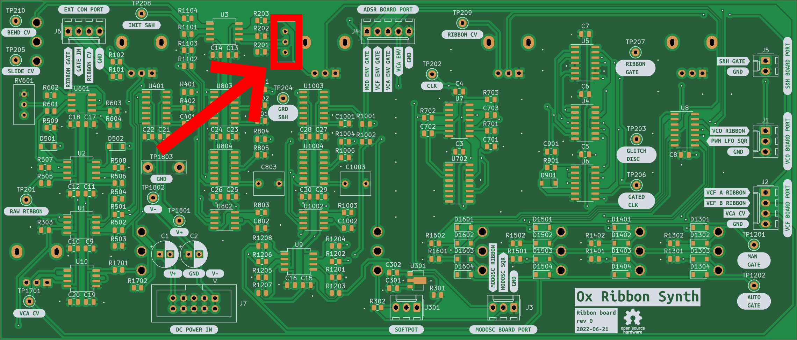

# Calibration Instructions

The steps below outline how to calibrate the instrument.

These instructions assume some familiarity with synthesizer calibration and access to test gear such as multimeters, oscilloscopes, frequency counters, and audio amplifiers for listening.

To calibrate the 1 volt per octave response of the VCO, Mod Osc, and VCF it is also necessary to have some external gear capable of providing a calibrated 1v/oct signal. This could be a CV sequencer or keyboard. If you don't intend to ever use this instrument with external CV, then there is no reason to perfectly calibrate the 1v/oct response.

These are not exhaustive, step-by-step instructions, but it should be enough to get you going if you know what you're doing.

Be aware that there is mains voltage inside the synth, keep away from the IEC power inlet, fuse holder, and power switch.

---

## Power Supply Board

The power supply board must be calibrated first thing, before any other circuit board calibration is attempted.

1. Apply 120VAC mains power to the IEC jack and turn the power switch ON
2. Clip the black lead of a multimeter to the `GND` test point
3. Monitor the `V+` test point with the red lead of the multimeter and adjust `RV1` for +15VDC
4. Do the same process with the `V-` test point and adjust `RV2` for -15VDC

## Main VCO Board

This board has a **lot** of trimmers, but it is less scary than it looks.

There are three main calibration groups:
- 1 volt per octave and tuning related calibration
- Suboscillator waveshape calibration
- Ring modulator reject calibration

Of these, the tuning calibration is the most important, the waveshape trimming is a matter of taste, and the ring-mod calibration can be ignored with no ill effect.

### VCO tuning calibration

There are three trimmers relating to tuning:
- `BASE TRIM` sets the base frequency for the VCO
- `SCALE TRIM` sets the 1 volt per octave scaling
- `H.F. TRIM` compensates for high frequency tuning errors

To calibrate the VCO tuning:
1. Turn all VCO modulation controls to zero
2. Inject a 1 volt per octave signal into the `VCO CV IN` jack
3. Monitor the VCO signal with a frequency counter and/or audio amplifier
    - the `MAIN OSC` test point is a convenient place to grab the signal
    - alternately use the main output jack and set the VCF and VCA to allow signal through
4. Instead of rewriting existing instructions, refer to the [SSI2130 datasheet](https://www.soundsemiconductor.com/downloads/ssi2130datasheet.pdf) calibration section, on page 12.

If you have calibrated VCO tuning before, you can largely ignore the instructions above and "wing it", calibration should be relatively straightforward.

Note that if you intend to only use the instrument with the built in ribbon controller, then VCO tuning is largely irrelevant. Just adjust it so that the range feels good to you.

### Suboctave calibration

The two suboctave circuits each have several trimmers for calibrating the waveshapes. These trimmers are largely identical between Suboctave 1 and Suboctave 2, except that Suboctave 2 has an extra trimmer for calibrating the special pulse wave.

Note that the suboctave waveshapes are derived from the original sawtooth by adding pulses, full wave rectifying, and distorting the signal. The resulting waveshapes are relatively clean, but expect some glitches and discontinuities in the waveshapes. Adjust the trimmers to the best of your ability, but don't expect perfection and trust your ears.

Suboctave 1 calibration procedure:
1. Monitor the `SUBOCT 1` test point with an oscilloscope
2. Turn Suboctave 1 to the "-0 octave" position (same octave as the main VCO)
3. Set the Suboctave 1 waveshape switch to `SAWTOOTH`
4. Adjust the trimmers labeled `(1)` and `(2)` in the image below for the cleanest sawtooth
5. Set the Suboctave 1 waveshape switch to `TRIANGLE`
6. Adjust the trimmer labeled `(3)` for the cleanest triangle
7. Set the Suboctave 1 waveshape switch to `SINE`
8. Adjust trimmers `(4)` and `(5)` for the cleanest sine wave

Suboctave 2 calibration:
1. Steps `1` through `8` are identical to suboctave 1, using the trimmers indicated below
2. Set the Suboctave 2 waveshape switch to `PULSE`
3. Adjust trimmer `(6)` so that the tops of the pulse train all line up

### Ring modulator calibration

I personally do not bother with this calibration, and in fact I do not even install the two ring-mod trimmers. This is not a precise balanced modulator, but rather a clangorous noise maker.

But if you wish to improve the dry signal bleedthrough of the ring mod, you can adjust the trimmers indicated below.

To do this you will need to kill the signal to each input one at a time while monitoring the output. It will be an iterative process to find trimmer settings with the least signal bleedthrough when only one signal is present. Or adjust them until it sounds good to you, or ignore them completely. IMO it sounds good no matter what you do here.

## Mod OSC Board

The Modulation Oscillator uses the same VCO core as the main VCO, and the tuning calibration is identical except that the frequency range goes lower.

See the [SSI2130 datasheet](https://www.soundsemiconductor.com/downloads/ssi2130datasheet.pdf) page 12 again for calibration instructions, or use your ears and a tuner. You can inject an external CV signal into the `MOD OSC CV IN` jack.

The Mod Osc is intended primarily for modulation duties, and precise tuning is not as critical as the main VCO.

## VCF/VCA board

The dual VCF has a couple of trimmers for calibration. The VCA does not require any calibration.

### VCF tuning calibration

1. Set the `SERIES/PARALLEL` switch to `PARALLEL` operation
2. Turn all audio sources (VCO, ring-mod, noise, etc) all the way off
3. Turn the VCF A resonance up until it self oscillates, and turn the VCF B resonance control all the way down
4. Inject a CV signal into the `VCF CV IN` jack
5. Monitor the self oscillating VCF with an audio amplifier/frequency counter/tuner
6. Adjust the `1V/OCT A TRIM` so that the self oscillating signal plays roughly in tune
7. Repeat this process for VCF B

Note that the tuning probably won't be as good as the VCO. Just get it in the ballpark, don't go crazy.

### VCF base frequency calibration

This calibration is largely a matter of taste. Here is what I do:

1. Adjust the VCO to be around 30Hz
2. Set the VCO waveshape to `PULSE`
3. Send just the main VCO into the VCF via the audio mixer
4. Set both VCF A and VCF B to lowpass mode
6. Turn the VCF Manual Frequency control fully CCW, set the Separation control to 12 o'clock
5. Adjust the `BASE FREQ n TRIM` trimmers such that the audio is *just barely* silenced
6. Sweep the VCF frequency control around a bit with various input signals and see if it feels good, if not tweak the `BASE FREQ n TRIM` trimmers

Once the VCF tuning and base frequency are roughly trimmed, I go back and make sure that they track well together and are very close to the same frequency when the Separation control is at 12 o'clock. 

## Ribbon board

The ribbon board has two trimmers for calibration:
- one trimmer for Note-On sensitivity `RV601`
- one trimmer for span adjustment `RV201`

On the first PCB revision there are no labels for these trimmers, oops, good thing there are only two of them.

### Note-On calibration

1. Monitor the `RIBBON GATE` test point with an oscilloscope
2. Tap the ribbon controller with your finger at the left-most end, where the lowest possible note is
3. Adjust the trimmer indicated below until tapping reliably triggers a gate signal at the `RIBBON GATE` test point
    - The trimmer should be set so that it reliably triggers, but no higher than that
    - If the gate gets stuck on after tapping, it is probably set too high

Once the ribbon gate is reliably firing, monitor the ribbon CV signal at the `SLIDE CV` test point
- If the ribbon CV sometimes drops back to zero after releasing your finger, the note-on trimmer is probably set too high

### Ribbon span calibration

The ribbon span calibration is a matter of taste. Here is how I set it up

1. Monitor the VCO with an audio amplifier and frequency counter/tuner
2. Turn the Ribbon Control pot to the VCO all the way up
3. Slide the ribbon from the bottom all the way to the top, back and forth
4. Adjust the trimmer indicated below such that the span is _ octaves

