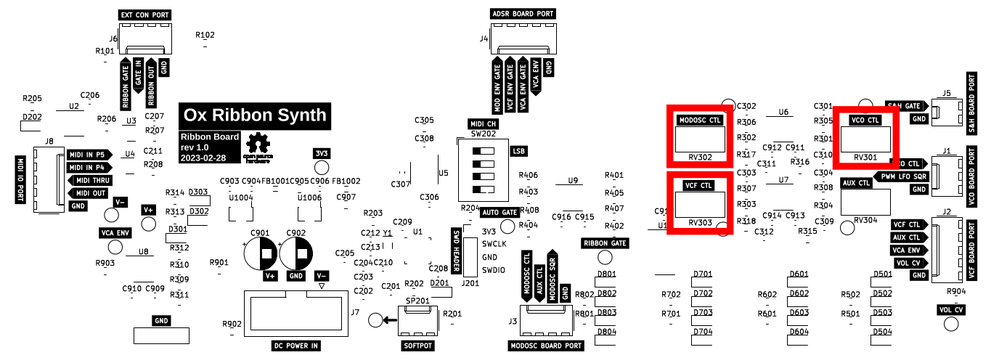
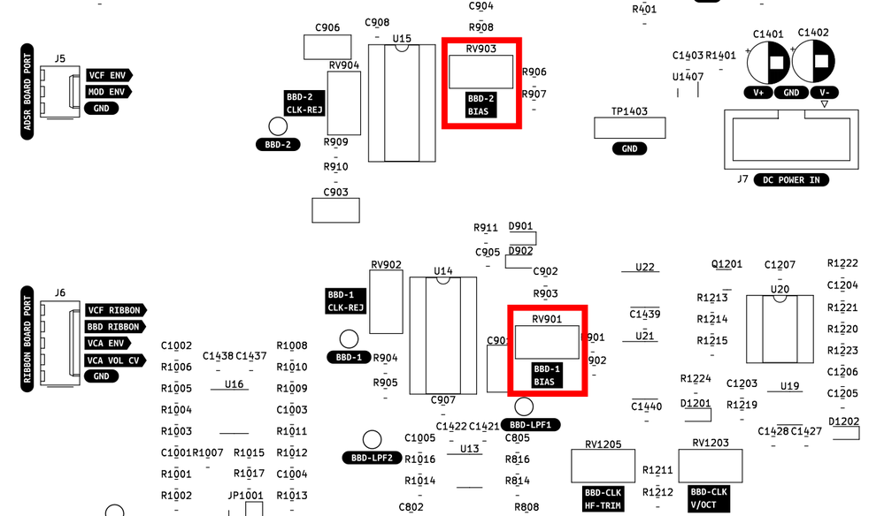
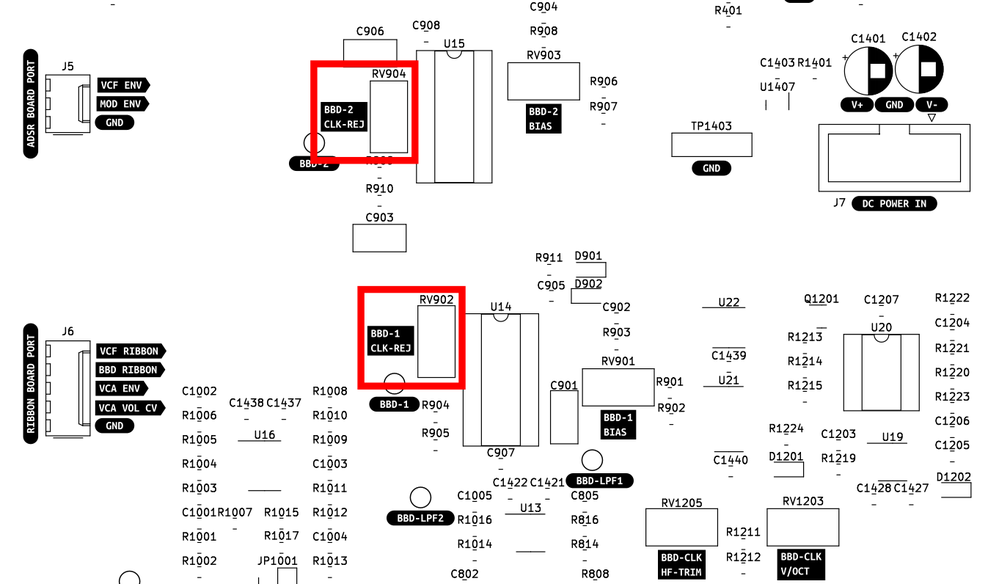
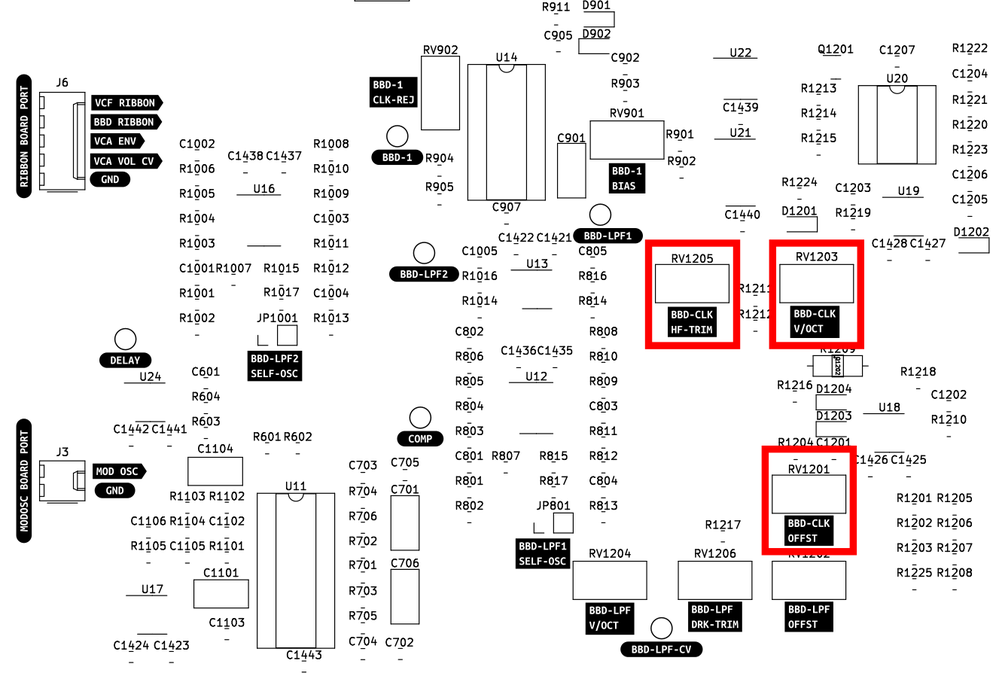
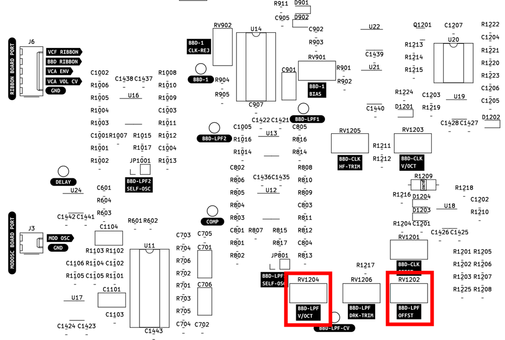
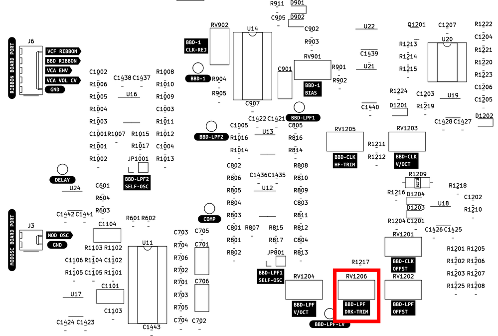

# Calibration Instructions

The steps below outline how to calibrate the instrument.

These instructions assume some familiarity with synthesizer calibration and access to test gear such as multimeters, oscilloscopes, frequency counters, and audio amplifiers for listening.

To calibrate the 1 volt per octave response of the VCO, Mod Osc, and VCF you can either use the calibrated ribbon controller in `QUANTIZE` mode or use external gear capable of providing a calibrated 1v/oct signal. This could be a CV sequencer or keyboard.

These are not exhaustive, step-by-step instructions, but it should be enough to get you going if you know what you're doing.

Be aware that there is mains voltage inside the synth, keep away from the IEC power inlet, fuse holder, and power switch.

---

## Accessing the electronics

The easiest way to access the inside of the instrument for calibration, repairs, or mods is to remove the wooden **bottom** cover. Leave the front panel attached to the wooden frame.

Once the bottom cover is off, I usually set the instrument on its side so that it sticks up in the air tall-ways. This makes it easier to access the front panel controls, jacks, and circuitboards all at the same time. It makes calibration easier if you can tweak the front panel controls as you adjust the internal trim potentiometers.

---

## Power Supply Board

**GOAL:** Provide +15.00 and -15.00 volts DC to the rest of the system

The power supply board must be calibrated first thing, before any other circuit board calibration is attempted.

1. Apply 120VAC mains power to the IEC jack and turn the power switch ON
2. Clip the black lead of a multimeter to the `GND` test point
3. Monitor the `V+` test point with the red lead of the multimeter and adjust `RV1` for +15VDC
4. Do the same process with the `V-` test point and adjust `RV2` for -15VDC

---

## Ribbon board

**GOAL:** Adjust the ribbon controller so that octaves are 1.000 volts apart

There are three ribbon outputs to calibrated:
1. Main VCO ribbon control
2. MODOSC ribbon control
3. VCF ribbon control
4. There is a 4th ribbon `AUX CTL`, currently unused

To calibrate the VCO control:
1. Turn the front panel `VCO` attenuator on the Ribbon front panel all the way clockwise
2. Set the front  panel `RIBBON MODE` switch to `QUANTIZE`
3. Slide your finger to the lowest point on the ribbon
4. Measure the voltage at the `VCO CTL` output, either on the Molex header or the small test point near the `VCO CTL` trimmer
5. This should be a very small voltage near 0.000, jot down the measured voltage as DELTA. If it is closer to 0.08 volts, make sure you're pressing at the lowest point of the ribbon
6. Slide your finger to the highest note on the ribbon
7. Adjust the `VCO CTL` trimmer until you measure (4.000 + DELTA) volts DC

Repeat these steps for the `MODOSC CTL` and `VCF CTL` trimmers
- Note that only the VCO ribbon signal is quantized, so expect more drifiting and variation from the MODOSC and VCF ribbon signals
- The VCO control is the most important. For the MODOSC and VCF just get them "good enough"
- Ignore the `AUX CTL` trimmer, unless you have added some functionality of your own

---

## Main VCO Board

This board has a **lot** of trimmers, but it is less scary than it looks.

There are three main calibration groups:
- 1 volt per octave and tuning related calibration
- Suboscillator waveshape calibration
- Ring modulator reject calibration

Of these, the tuning calibration is the most important, the waveshape trimming is a matter of taste, and the ring-mod calibration can be ignored with no ill effect.

### VCO tuning calibration

**GOAL:** Trim the VCO to play in tune when fed with 1volt/octave CV sources

There are three trimmers relating to tuning:
- `BASE TRIM` sets the base frequency for the VCO
- `SCALE TRIM` sets the 1 volt per octave scaling
- `H.F. TRIM` compensates for high frequency tuning errors

To calibrate the VCO tuning:
1. Turn all VCO modulation controls to zero
2. Use the calibrated ribbon controller set to `QUANTIZE` mode or inject a 1 volt per octave signal into the `VCO CV IN` jack
3. Monitor the VCO signal with a frequency counter and/or audio amplifier
    - the `MAIN OSC` test point is a convenient place to grab the signal
    - alternately use the main output jack and set the VCF and VCA to allow signal through
4. Instead of rewriting existing instructions, refer to the [SSI2130 datasheet](https://www.soundsemiconductor.com/downloads/ssi2130datasheet.pdf) calibration section, on page 12.

If you have calibrated VCO tuning before, you can largely ignore the instructions above and "wing it", calibration should be relatively straightforward.

Note that if you intend to only use the instrument with the built in ribbon controller, then VCO tuning is largely irrelevant. Just adjust it so that the range feels good to you.

### Suboctave calibration

**GOAL:** Trim the suboctaves for clean waveforms and minimal glitches

The two suboctave circuits each have several trimmers for calibrating the waveshapes. These trimmers are largely identical between Suboctave 1 and Suboctave 2, except that Suboctave 2 has an extra trimmer for calibrating the special pulse wave.

Note that the suboctave waveshapes are derived from the original sawtooth by adding pulses, full wave rectifying, and distorting the signal. The resulting waveshapes are relatively clean, but expect some glitches and discontinuities in the waveshapes. Adjust the trimmers to the best of your ability, but don't expect perfection and trust your ears.

Suboctave 1 calibration procedure:
1. Monitor the `SUBOCT 1` test point with an oscilloscope
2. Turn Suboctave 1 to the "-0 octave" position (same octave as the main VCO)
3. Set the Suboctave 1 waveshape switch to `SAWTOOTH`
4. Adjust the trimmers labeled `(1)` and `(2)` in the image below for the cleanest sawtooth
5. Set the Suboctave 1 waveshape switch to `TRIANGLE`
6. Adjust the trimmer labeled `(3)` for the cleanest triangle
7. Set the Suboctave 1 waveshape switch to `SINE`
8. Adjust trimmers `(4)` and `(5)` for the cleanest sine wave

Suboctave 2 calibration:
1. Steps `1` through `8` are identical to suboctave 1, using the trimmers indicated below
2. Set the Suboctave 2 waveshape switch to `PULSE`
3. Adjust trimmer `(6)` so that the tops of the pulse train all line up

### Ring modulator calibration

**GOAL:** Minimize ring modulator bleedthrough

I personally do not bother with this calibration, and in fact I do not even install the two ring-mod trimmers. This is not a precise balanced modulator, but rather a clangorous noise maker.

But if you wish to improve the dry signal bleedthrough of the ring mod, you can adjust the trimmers indicated below.

To do this you will need to kill the signal to each input one at a time while monitoring the output. It will be an iterative process to find trimmer settings with the least signal bleedthrough when only one signal is present. Or adjust them until it sounds good to you, or ignore them completely. IMO it sounds good no matter what you do here.

---

## Mod OSC Board

**GOAL:** Trim the MODOSC VCO to play in tune when fed with 1volt/octave CV sources

The Modulation Oscillator uses the same VCO core as the main VCO, and the tuning calibration is identical except that the frequency range goes lower.

See the [SSI2130 datasheet](https://www.soundsemiconductor.com/downloads/ssi2130datasheet.pdf) page 12 again for calibration instructions, or use your ears and a tuner. You can inject an external CV signal into the `MOD OSC CV IN` jack or use the calibrated ribbon controller.

The Mod Osc is intended primarily for modulation duties, and precise tuning is not as critical as the main VCO.

---

## VCF/VCA/BBD board

The dual VCF has a couple of trimmers for calibration. The VCA does not require any calibration. The BBD analog delay has many trimmers, but several of them are not necessary to obsess over. 

### VCF tuning calibration

**GOAL** Trim the filters to play in tune when fed with 1volt/octave CV sources

1. Set the `SERIES/PARALLEL` switch to `PARALLEL` operation
2. Turn all audio sources (VCO, ring-mod, noise, etc) all the way off
3. Turn the VCF A resonance up until it self oscillates, and turn the VCF B resonance control all the way down
4. Inject a CV signal into the `VCF CV IN` jack or use the calibrated ribbon controller as the control voltage source
5. Monitor the self oscillating VCF with an audio amplifier/frequency counter/tuner
6. Adjust the `1V/OCT A TRIM` so that the self oscillating signal plays roughly in tune
7. Repeat this process for VCF B

Note that the tuning probably won't be as good as the VCO. Just get it in the ballpark, don't go crazy.

### VCF base frequency calibration

**GOAL** Adjust the filters so that the base frequency when the controls are turned all the way down feels good to the user

This calibration is largely a matter of taste. Here is what I do:

1. Adjust the VCO to be around 30Hz
2. Set the VCO waveshape to `PULSE`
3. Send just the main VCO into the VCF via the audio mixer
4. Set both VCF A and VCF B to lowpass mode
6. Turn the VCF Manual Frequency control fully CCW, set the Separation control to 12 o'clock
5. Adjust the `BASE FREQ n TRIM` trimmers such that the audio is *just barely* silenced
6. Sweep the VCF frequency control around a bit with various input signals and see if it feels good, if not tweak the `BASE FREQ n TRIM` trimmers

Once the VCF tuning and base frequency are roughly trimmed, I go back and make sure that they track well together and are very close to the same frequency when the Separation control is at 12 o'clock. 

### BBD bias calibration

**GOAL** Maximize BBD headroom

The analog delay chips may be biased for maximum headroom. This is a matter of taste, and you may prefer the sound of more asymmetric distortion.

1. Set the delay time somewhere between 10 o'clock and 1 o'clock, it is not critical exactly where
2. Set the delay repeats all the way down
3. Set the VCO waveshape to `SINE` or `TRIANGLE`
4. Send just the main VCO into the VCF via the audio mixer
5. Set both VCF A and VCF B to lowpass mode, frequency all with way up and resonance all the way down
6. Monitor the signal at the `BBD-1` test point
7. Experiment with turning the level of the VCO up and down, and adjusting the `BBD-1 BIAS` trim pot
8. At some points you should see asymmetric clipping on either the top or bottom of the waveform
9. Adjust the `BBD-1 BIAS` trimpot to allow the largest possible input signal through without clipping
10. Do some listening tests with various settings, trust your ears
11. Repeat for BBD 2

### BBD clock reject calibration

**GOAL** Minimize BBD clock bleedthrough

The analog delay has trimmers to reject clock frequencies from bleeding into the audio. This is one you want to get right, but it is not hard.

Note that this delay design intentionally pushes the delay time past what is reasonable for this kind of circuit. It is intended that at maxumum delay time there will be aliasing and noise introduced for gritty and unusual sounds. If you need to compromise on minimizing bleedthrough over some range, favor making the bottom 2/3 of the delay time knob sound good. The far clockwise end of the delay time knob is for crazy time.

1. Turn off all audio signals going into the VCF board
2. Set the delay time to somewhere between 1 o'clock and maximum
3. Turn the delay repeats all the way down
4. Turn the delay mix fully clockwise
5. Set the `LPF MODE` switch to `BRIGHT`
6. Set the delay `BYPASS` switch to `ON`
7. Listen to the main output jack with an audio amplifier
8. With enough volume you will probably hear an annoying high pitched sound that changes pitch when you adjust the delay time control, this is the BBD clock bleeding into the audio path
9. Adjust the `BBD-n CLK-REJ` trimmers to minimize the bleedthrough, this may be iterative, so go back and forth between them to get the noise as low as possible
10. Sweep the delay time up and down to make sure the bleedthrough doesn't have any trouble spots at certain frequencies
11. You can also monitor this signal with an oscilloscope, I find it easier to minimize by ear but a scope can help to verify things

### BBD clock scaling

**GOAL** Trim the BBD clock to have a nice range for the user

The analog delay has a complex clock circuit, allowing for 1volt/octave scaling. However, this complexity is somewhat wasted. There is no great reason to calibrate for good tracking. What matters is that the range of the delay time feels good to the user.

The `BBD-CLK HF-TRIM` is an optional high-frequency compensation circuit, this can be ignored completely.

If you hack the instrument to somehow respond to 1volt/octave delay control, then adjust these trimmers to get the delay as in-tune as possible. But otherwise don't worry about them too much.

### BBD LPF scaling

**GOAL** To make the analog delay pre/post lowpass filters track along with the delay clock when the `LPF MODE` switch is in the `TRACK` position

Like the BBD clock, the filtering scheme is a bit too complex for its own good. There are pre and post 24dB/octave tracking lowpass filters which can be calibrated to follow the delay time.

For normal use, it is not important to precisely adjust these trimmers, just tune by ear so it sounds nice in `TRACK` mode.

If you do plan on calibrating for decent 1volt/octave tracking, there are `BBD-LPFn SELF-OSC` jumpers installed which will cause the lowpass filters to self-oscillate when shorted. This allows you to monitor the BBD clock and LPF together to verify that the frequencies track together.

### BBD LPF dark mode trim

**GOAL** Set the BBD pre/post lowpass filters to a fixed cutoff frequency when the `LPF MODE` switch is in the `DARK` position

This calibration is a matter of taste. Classic analog delay pedals typically had a lowpass frequency of somewhere around 3kHz. 

Either set this trimmer by ear with the `LPF MODE` switch is in the `DARK` position, or short the `BBD-LPFn SELF-OSC` jumpers and verify with a frequency counter.

