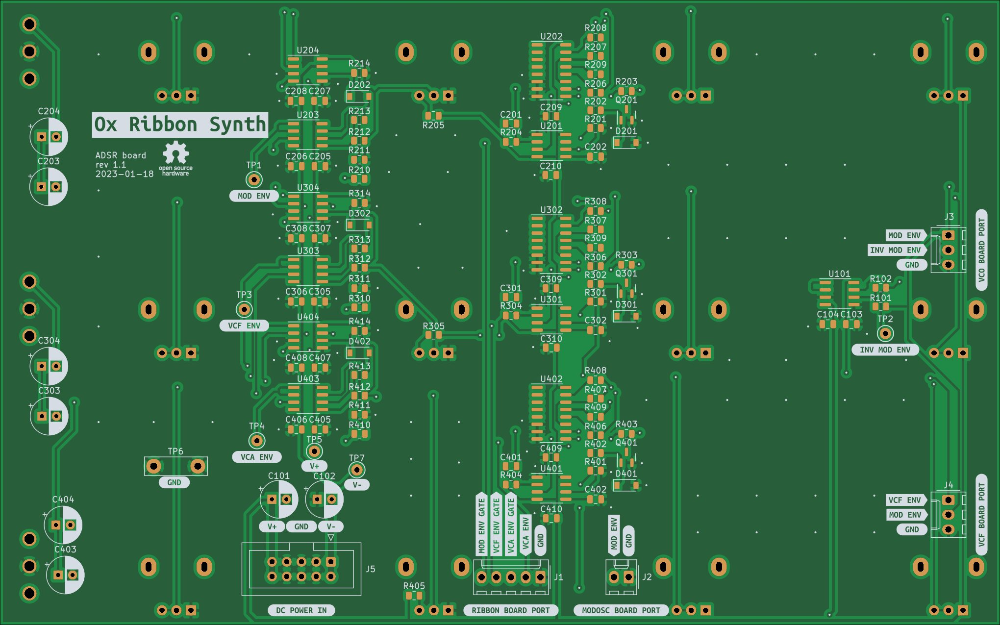

# Triple ADSR Board

## [SCHEMATIC](https://github.com/JordanAceto/josh_Ox_ribbon_synth/blob/master/circuit_boards/ADSR_board/docs/ADSR_board-schematic.pdf)

Three ADSR envelope generators with short and long time range switch.

A comparator and analog switch ensure that the sustain control reacts quickly during sustain phases, even when the decay control is set for long time constants.

