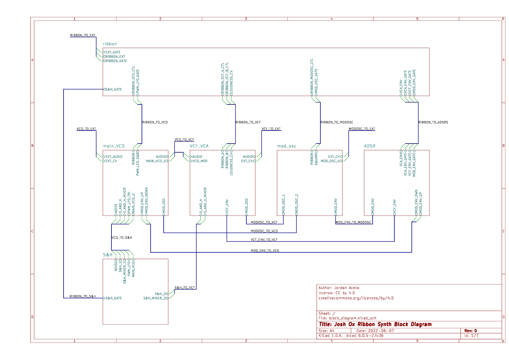

# Ox Ribbon Synth Circuit Boards

## The synth is made up of the following components:
- Power Entry and step-down AC transformer
- AC-DC power supply board
    - Provides regulated +/- 15 VDC to the rest of the system
- Main VCO board
    - Contains two fully featured sub-scillators, a ring-modulator, pulse-width modulation LFO, and audio mixer
- VCF/VCA board
    - Contains a dual State Variable Filter setup with series/parallel switching and rich modulation
- Sample & Hold board
    - With three input mixer, white/pink noise source, and glide control
- Modulation Oscillator
    - Wide frequency range, five waveforms, and delayed modulation capability
- ADSR board
    - Three independent ADSR generators
- Ribbon board
    - Generates ribbon CV and gate signals
    - routes and combines ribbon gate and auto-gate

## Each major system component has its own subdirectory with:
- All files needed to edit the schematic and PCB layout with KiCad 6
- A simple-to-navigate HTML page with all documentation files needed to build and troubleshoot the circuits
    - The documentation is generated by the [KiBot tool](https://github.com/INTI-CMNB/KiBot), see the `.kibot` directory for more information

## The approximate current draw of the circuitboards is:

| Board     | V+    | V-    |
| --------- | ----- | ----- |
| ADSR      | 30mA  | 20mA  |
| main VCO  | 120mA | 100mA |
| mod osc   | 20mA  | 10mA  |
| ribbon    | 40mA  | 20mA  |
| S&H       | 20mA  | 20mA  |
| VCF/VCA   | 60mA  | 50mA  |
|           |       |       |
| **TOTAL** | 290mA | 220mA |

## The block diagram below illustrates how the components interact:

