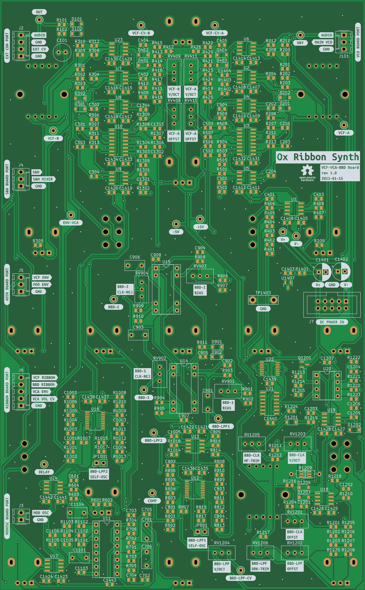

# VCF/VCA/BBD Board

## [SCHEMATIC](https://github.com/JordanAceto/josh_Ox_ribbon_synth/blob/master/circuit_boards/VCF_VCA_BBD_board/docs/VCF_VCA_BBD_board-schematic.pdf)

This board contains a dual State Variable Filter, Bucket Brigade Analog Delay, and two linear audio VCAs.

### State Variable Filters
- each filter has Lowpass, Bandpass, Highpass and Notch outputs
- filters can be routed in either Serial or Parallel configuration
- CV mixer for a variety of modulation
- control to filter A can be inverted relative to filter B

### Analog Delay
- about 40 milliseconds to 1 second of delay
- modulation input with attenuverter
- three lowpass filter modes:
    - `BRIGHT`: no filtration, aliasing occurs at long delay times. Aliasing is normally avoided, but it can sound good in a nasty way. Useful for extreme effects
    - `TRACK`: lowpass filter tracks the delay clock, brighter at short times and darker at long times
    - `DARK`: classic warm BBD sound

### VCAs
- one VCA for the volume ADSR before the analog delay
- one VCA for the final master volume control after the delay

## Measurements to aid in calibration (no ribbon ctl, no modulation, knob swept ccw to cw, approx):
- VCF freq range: 12Hz, 12kHz
- delay clk: 100kHz, 4kHz
- delay lpf
    - track mode: 60kHz, 3kHz
    - bright mode: fixed 20kHz
    - dark mode: fixed 3kHz
