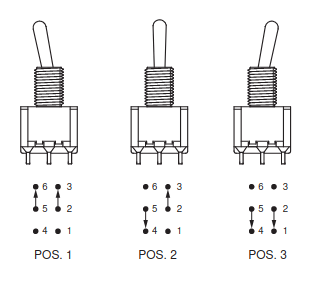
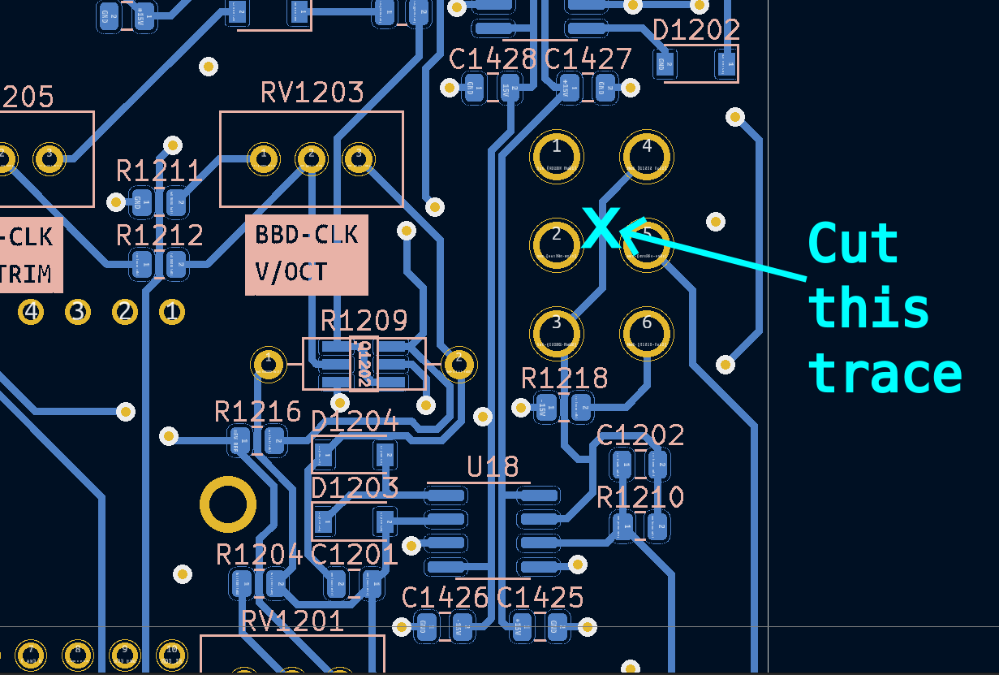
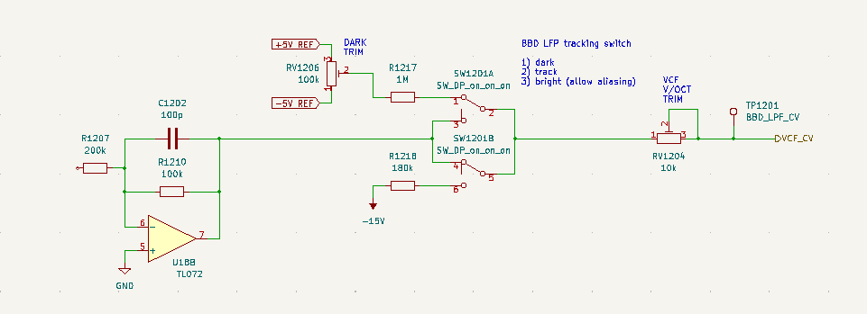
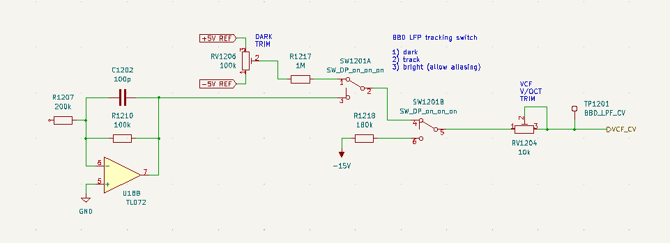
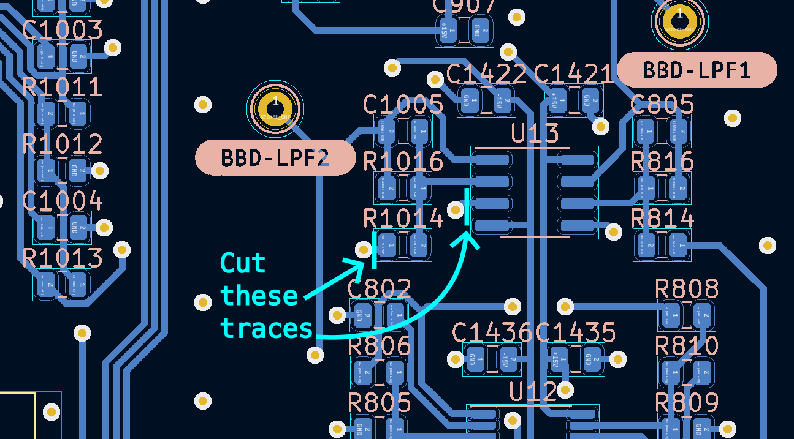
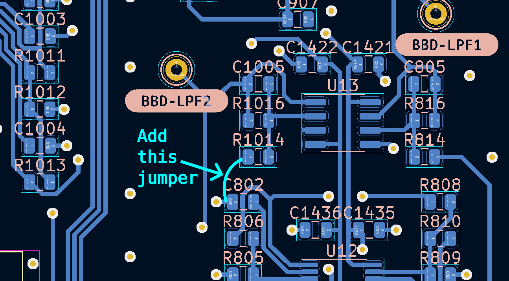
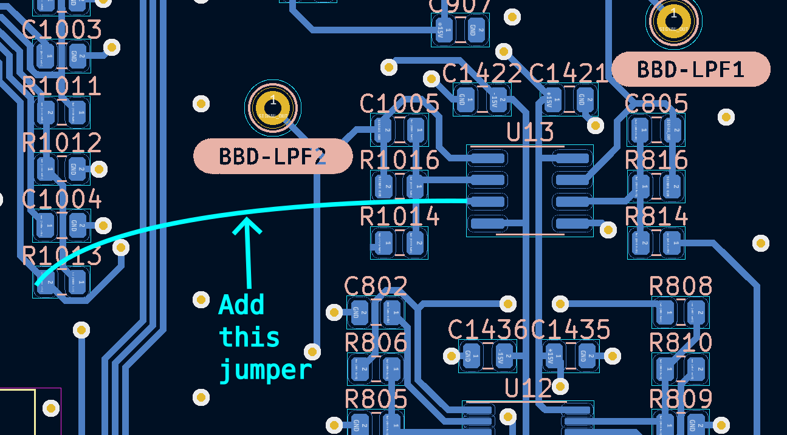
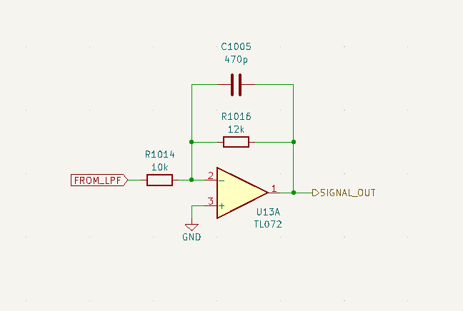
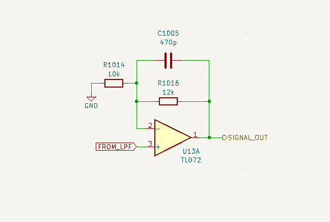

# VCF/VCA/BBD PCB Kludges

The VCF board needs a minor pcb kludge for the analog delay `LPF MODE` switch to work.

Without this kludge the system will still work, but the `LPF MODE` switch will be in `TRACK` mode in all three positions.

The switch kludge must be done **before** installing the `LPF MODE` toggle switch. All steps happen right in the vicinity of the `LPF MODE` SW1201 switch in the Analog Delay section.

This switch is an "ON-ON-ON" style DP mini toggle like this:

An optional kludge may also be performed to invert the analog delay wet signal by configuring an opamp as a non-inverting amplifier instead of an inverting one. It sounds a little better to me after the kludge, but this does not have a major impact for most patches.

---

## Switch kludge step 1: cut a trace on the front of the PCB

The front of the PCB is the side that the pots and switches mount to.

With a sharp x-acto knife or similar tool, cut the indicated circuitboard trace.

---

## Switch kludge step 2: cut a trace on the rear of the PCB

The rear of the PCB is the side with the ICs and passives soldered to it.

Cut the specified trace.

---

## Switch kludge step 3: add a short jumper

On the rear of the PCB, solder a jumper made of wire or a resistor leg clipping as shown.

---

## Simplified schematice showing the result of the switch kludge

### Before the kludge, the switch is like this (clearly wrong). You can see that in every position the opamp output is asserted at the right side of the switch.

### After the kludge the effective schematic view of the switch is like this. Now each of the three switch positions is a unique setting.

---

## Optional opamp kludge step 1: cut two traces

With a sharp x-acto knife cut the two indicated traces near opamp U13A.

---

## Optional opamp kludge step 2: ground the left side of R1014

Jumper the left side of R1014 to any convenient ground point. You can scrape away some of the solder mask on the ground plane, or connect it to the left side of capacitor C802 as shown.

---

## Optional opamp kludge step 3: connect the LPF output to the non-inverting input

jumper the output of lowpass filter chip U16 to the non-inverting input of opamp U13A as shown. Note that you can get the output of U16 at the left side of resistor R1013.

---

## Simplified schematice showing the result of the opamp kludge

### Before the kludge opamp U13A acts as an inverting amplifier with a gain of 1.2

### After the kludge opamp U13A acts as a non-ionverting amplifier with a gain of 2.2

If desired the gain of the delay loop can be easily changed in a few places, but the values after the kludge feel good to me as shown.
