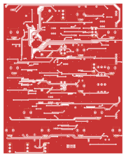

# Complex VCO

## [SCHEMATIC](https://github.com/JordanAceto/josh_Ox_ribbon_synth/blob/master/circuit_boards/main_VCO_board/docs/main_VCO_board_schematic.pdf)

Single VCO with tons 'o extra stuff
- SSI2130 VCO core
- sine, triangle, sawtooth, and variable pulse waveforms
- two suboscillators, each with all four waveforms, phase modulated (not locked) to the main VCO
- PWM LFO
- transformer/diode based ring modulator
- audio mixer
- FM mixer

