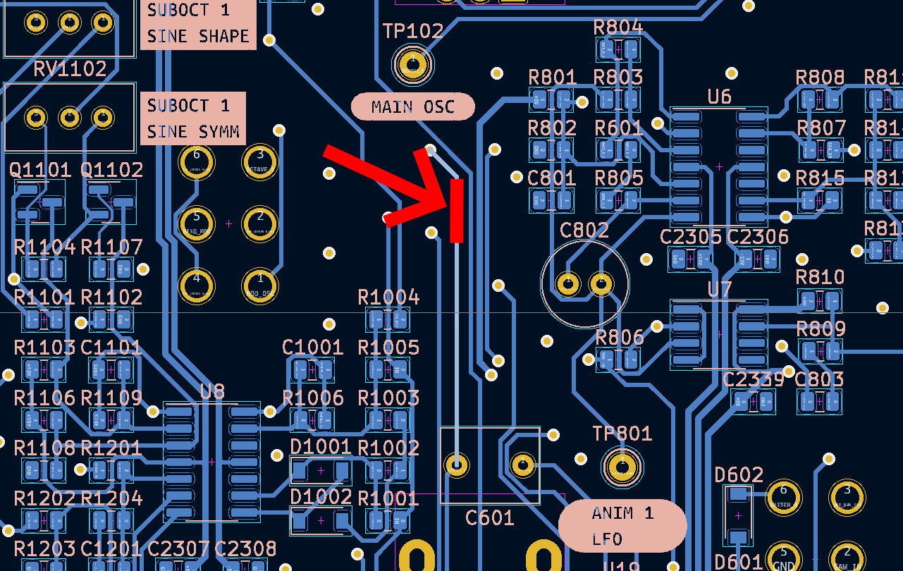
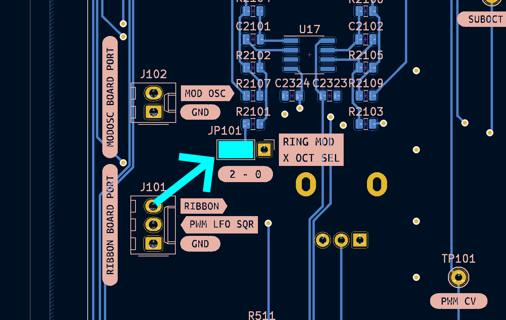
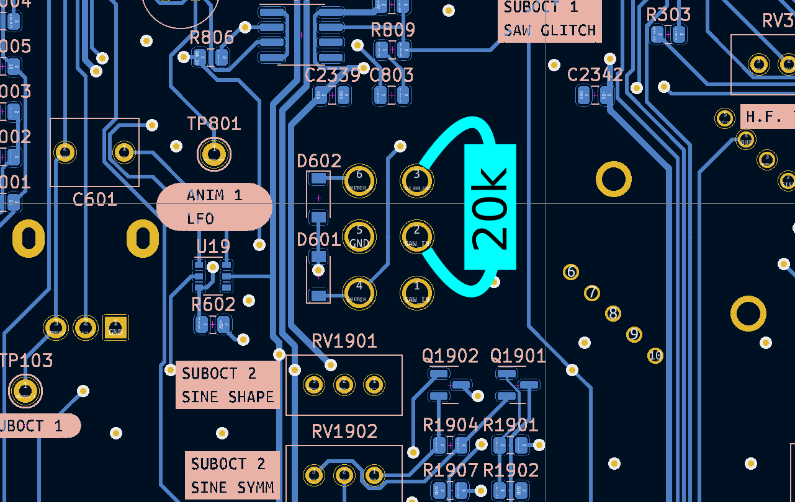
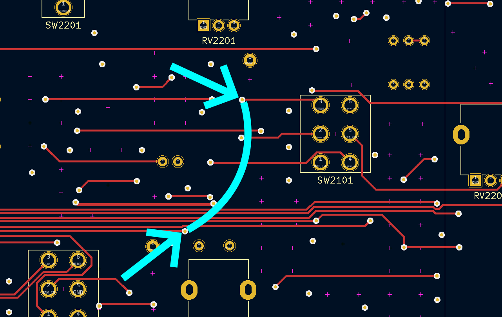

# Main VCO PCB Kludges

The main VCO needs a few minor pcb kludges for the ring modulator to work correctly.

These kludges ensure that the ring modulator works even when the individual octave switches are in the `OFF` position.

A future PCB revision should rework how the suboctave switching is accomplished, and fix the issues with the ring mod inputs so that these kludges are no longer necessary.

A revision may not happen for a long time, and these instructions make it so the ring mod is functional in the meantime.

---

## Step 1: cut a trace

With a sharp x-acto knife or similar tool, cut the indicated circuit board trace.

---

## Step 2: add a jumper to hardwire the input

Use a small piece of wire or resistor leg clipping to hardwire the `RING MOD X SEL` jumper as shown.

Note that the silkscreen indicates that this will apply suboct 2 to the ring mod input, but the silkscreen is incorrect, this actually injects the main octave (octave 0).

---

## Step 3: add a resistor to the Suboct 1 octave selector switch

Solder a 10k ~ 20k resistor to the pins of the DPDT switch as indicated. The exact value is not critical.

## Step 4: add a jumper between two vias

Solder a small length of insulated wire to create a jumper between the two vias shown.

This wire is placed on the side of the board with the pots and switches in the image below (and on the physical instrument that Ox has possesion of), but it could go on either side of the board if preferred.

