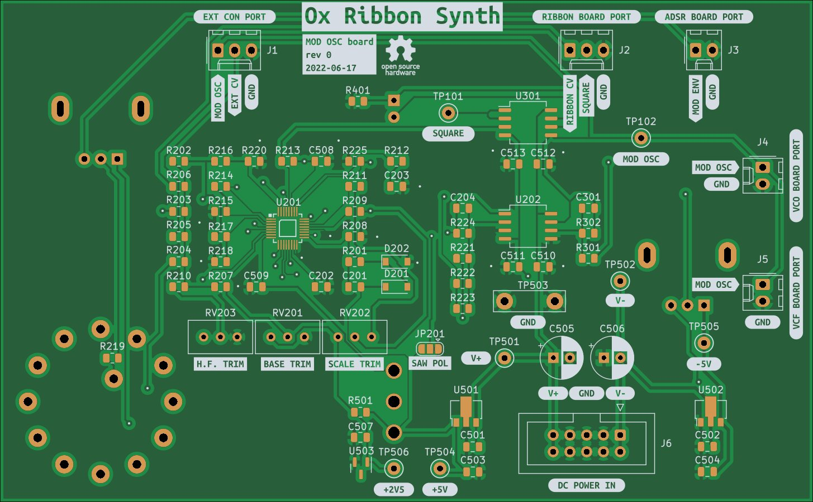

# Modulation Oscillator

## [SCHEMATIC](https://github.com/JordanAceto/josh_Ox_ribbon_synth/blob/master/circuit_boards/mod_osc_board/docs/mod_osc_board-schematic.pdf)

Auxilliary modulation oscillator
- SSI21340 VCO core
- sine, triangle, up and down-going sawtooth, and square waveforms
- wide frequency range with three range settings (low, normal, high)
- tracks the ribbon controller

