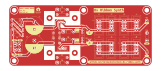
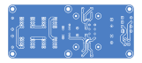

# Power Supply Board

## [SCHEMATIC](https://github.com/JordanAceto/josh_Ox_ribbon_synth/blob/master/circuit_boards/power_supply_board/docs/power_supply_schematic.pdf)

This is an unremarkable LM317/LM337 based bipolar 15 volt DC supply which supplies power to the rest of the system.

