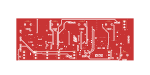

# ribbon_board

## [SCHEMATIC](https://github.com/JordanAceto/josh_Ox_ribbon_synth/blob/master/circuit_boards/ribbon_board/docs/ribbon_board_schematic.pdf)

Digital ribbon controller, gate combiner, and VCA control scaler

