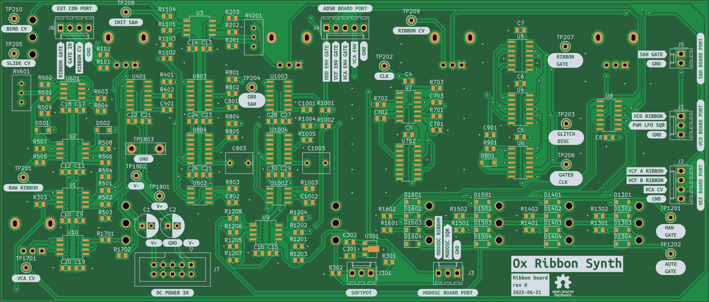

# Ribbon Controller

## [SCHEMATIC](https://github.com/JordanAceto/josh_Ox_ribbon_synth/blob/master/circuit_boards/ribbon_board/docs/ribbon_board-schematic.pdf)

Ribbon and gate controller board. The ribbon controller is based on the "Appendage" controller discussed at the electro-music.com DIY section.

This board also scales the VCA control voltage signal before sending it to the VCF/VCA board.

